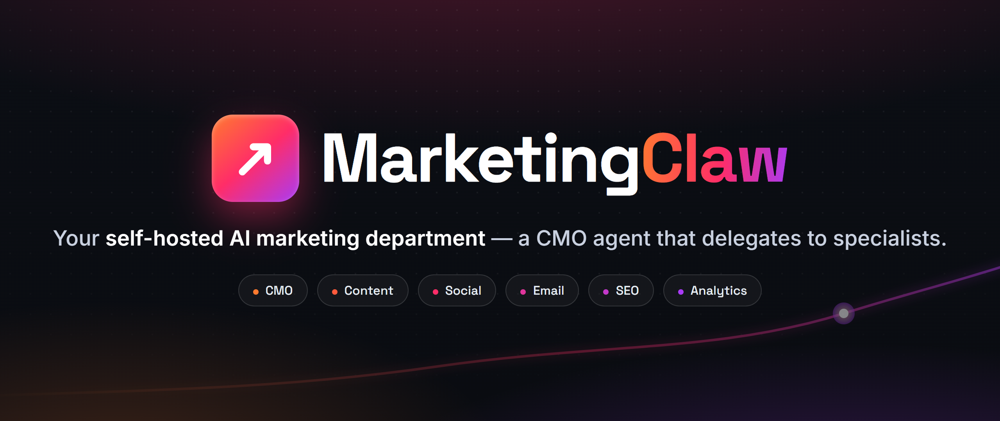

<div align="center">

<a href="https://youssefnagy.com/marketingclaw">
  
</a>

<h3>Your self-hosted AI marketing department — a CMO agent that delegates to specialists.</h3>

[](https://youssefnagy.com/marketingclaw)
[](LICENSE)
[](#quick-start-from-source)
[](#how-it-works)
[](https://github.com/openclaw/openclaw)

<a href="#quick-start-from-source"><b>Quick start</b></a> &nbsp;·&nbsp;
<a href="https://youssefnagy.com/marketingclaw"><b>Website</b></a> &nbsp;·&nbsp;
<a href="docs/start/marketing-quickstart.md"><b>Docs</b></a> &nbsp;·&nbsp;
<a href="#meet-the-team"><b>The team</b></a> &nbsp;·&nbsp;
<a href="#security-defaults-dm-access"><b>Security</b></a> &nbsp;·&nbsp;
<a href="VISION.md"><b>Vision</b></a>

</div>

---

**MarketingClaw** is an open-source, self-hosted AI marketing team you run on your own
hardware. Instead of a single chatbot, you get a small org: a **CMO agent** that owns
strategy and delegates, plus specialists for **content, social, email, SEO, and
analytics**. They plan campaigns, draft copy, schedule posts, run the newsletter, and
report on the numbers — and they answer you on the channels you already use.

It is for founders, small teams, and in-house marketers who want a marketing team that
runs on their own infrastructure, keeps every decision as a **file they can read and
diff**, and **never ships anything public without approval**.

## Meet the team

`setup-marketing` provisions a flat team of six role agents — one orchestrator and five
specialists — each with its own workspace, skills, and schedule.

| Agent      | Role               | What they do                                                                                                             |
| ---------- | ------------------ | ------------------------------------------------------------------------------------------------------------------------ |
| **Morgan** | CMO · orchestrator | The default agent for every DM. Owns the campaign plan and calendar, breaks work down, and delegates to the specialists. |
| **Sasha**  | Content            | Long-form and copy — blog drafts, landing pages, post copy. Writes to files and hands off; never publishes directly.     |
| **Riley**  | Social             | Schedules and publishes across your social accounts via Postiz, and triages mentions.                                    |
| **Jordan** | Email              | Runs newsletters and lifecycle email with a **draft → test → approve → send** discipline, and watches deliverability.    |
| **Quinn**  | SEO                | Keyword research, on-page audits, and the blog pipeline into your CMS or git.                                            |
| **Alex**   | Analytics          | Pulls the numbers from GA4, Search Console, and your platforms into weekly reports and flags what changed.               |

## What's in the box

- **A real team, not a prompt.** Six agents coordinating through the native multi-agent
  runtime — the CMO delegates with `sessions_spawn`, specialists own their lane.
- **Skills that actually publish.** Bring-your-own-key integrations for
  [Postiz](skills/postiz) (20+ social networks), [Listmonk](skills/listmonk) (email),
  [WordPress](skills/wordpress) and [git-based blogs](skills/blog-git),
  [Search Console](skills/gsc) and [GA4](skills/ga4),
  plus [keyword research](skills/keyword-research), [SEO audits](skills/seo-audit), and
  [weekly reporting](skills/marketing-report).
- **Runs on autopilot.** `setup-marketing` installs a default cron set: a weekly content
  calendar, a daily publish-queue reconcile, a weekly analytics report, a monthly SEO
  audit, and a weekly email-health check.
- **Reachable everywhere.** WhatsApp, Telegram, Slack, Discord, Google Chat, Signal,
  iMessage, Microsoft Teams, Matrix, IRC, and [~20 more channels](docs/channels/index.md)
  — plus the built-in WebChat.
- **Everything is a file.** `BRAND.md`, the campaign plan, the content calendar, the post
  log, and the report archive live in a git-tracked directory you own.

## Quick start (from source)

Runtime: **Node 24 (recommended) or Node 22.19+**. MarketingClaw is a pnpm workspace;
use `pnpm` for source checkouts.

```bash
git clone https://github.com/promisingcoder/marketingclaw.git
cd marketingclaw

pnpm install
pnpm build && pnpm ui:build

# First run: guided setup of the gateway, workspace, and model provider
pnpm marketingclaw onboard

# Provision the marketing team: a short brand interview writes BRAND.md and
# creates the six-agent roster (Morgan, Sasha, Riley, Jordan, Quinn, Alex)
pnpm marketingclaw setup-marketing

# Start the gateway, then open the dashboard
pnpm marketingclaw gateway
pnpm marketingclaw dashboard
```

> `setup-marketing` is the one new command MarketingClaw adds on top of the engine.
> If you skip it, `onboard` alone still seeds a marketing-flavored workspace with the
> CMO — run `setup-marketing` at any time to provision the full team; it's idempotent.
> The full walkthrough lives in
> [docs/start/marketing-quickstart.md](docs/start/marketing-quickstart.md).

Bring your own model API key (Anthropic, OpenAI, Google, and others); onboarding prompts
for it. Prefer a current flagship model for the CMO and copy work.

## Security defaults (DM access)

MarketingClaw connects to real messaging surfaces, so it treats inbound DMs as
**untrusted input**.

- **DM pairing is on by default.** Unknown senders get a short pairing code and their
  message is not processed until you approve it with
  `marketingclaw pairing approve <channel> <code>`. Approved senders are added to a local
  allowlist.
- **Public inbound requires an explicit opt-in** (`dmPolicy="open"` plus `"*"` in the
  channel allowlist). Run `marketingclaw doctor` to surface risky DM policies.
- **Sandboxing for shared surfaces.** For non-`main` sessions (group chats, shared
  channels), set `agents.defaults.sandbox.mode: "non-main"` so tools run inside a sandbox.
  The specialists that publish are approval-gated regardless of sandbox.

Before exposing anything remotely, read the security docs:
[Security](docs/gateway/security/index.md),
[Exposure runbook](docs/gateway/security/exposure-runbook.md),
[Sandboxing](docs/gateway/sandboxing.md), and
[Configuration](docs/gateway/configuration.md).

## How it works

The **Gateway** is the control plane: it runs on your machine (or a server), holds the
sessions, and connects every channel at once. On top of it, MarketingClaw adds a flat
team of role agents and a shared, file-based workspace under `~/.marketingclaw/marketing/`
— `BRAND.md`, the campaign plan, the content calendar, and the report archive. Everything
the team decides is a plain file you can open, edit, and put under version control, and
**nothing goes public without an approval**.

Ask Morgan in chat — _"Draft this week's newsletter,"_ _"Audit our landing page SEO,"_
_"Plan next week's content calendar"_ — and she breaks the work down, hands drafts to the
right specialist, and brings the result back for your sign-off.

## Attribution

MarketingClaw is a fork of [github.com/openclaw/openclaw](https://github.com/openclaw/openclaw)
(MIT), created by Peter Steinberger and its community. The gateway, messaging channels,
agent runtime, and companion apps are the upstream project's work; MarketingClaw adds the
marketing team, its skills, and the onboarding that provisions them. Engine-level fixes
belong upstream. Full third-party attribution and the retained upstream release history
live in [THIRD_PARTY_NOTICES.md](THIRD_PARTY_NOTICES.md) and
[UPSTREAM-CHANGELOG.md](UPSTREAM-CHANGELOG.md).

## License

MIT — see [LICENSE](LICENSE). Contribution guidelines are in
[CONTRIBUTING.md](CONTRIBUTING.md); the project direction is in [VISION.md](VISION.md);
report vulnerabilities via [SECURITY.md](SECURITY.md).

<div align="center">
<br>
<sub><b><a href="https://youssefnagy.com/marketingclaw">youssefnagy.com/marketingclaw</a></b> &nbsp;·&nbsp; built on <a href="https://github.com/openclaw/openclaw">OpenClaw</a> &nbsp;·&nbsp; self-hosted &nbsp;·&nbsp; approval-first</sub>
</div>
