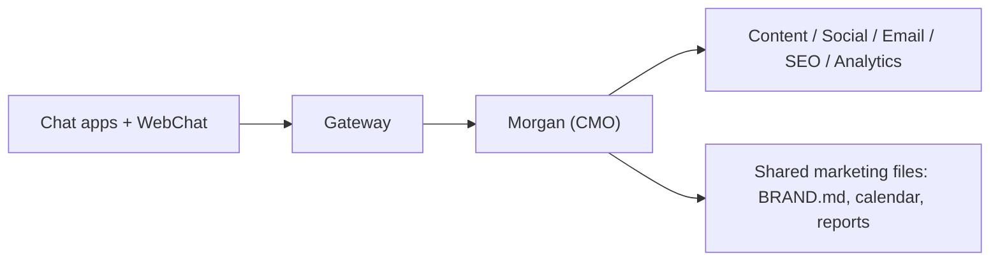

# MarketingClaw

  <strong>Your self-hosted AI marketing department — a CMO agent and specialists for content, social, email, SEO, and analytics, reachable on the channels you already use.</strong>

<Columns>
  <Card title="Marketing quick start" href="/start/marketing-quickstart" icon="rocket">
    Install from source, onboard, and provision the marketing team.
  </Card>
  <Card title="Configuration" href="/gateway/configuration" icon="settings">
    Models, agents, tools, sandbox, and Gateway settings.
  </Card>
  <Card title="Channels" href="/channels" icon="message-square">
    Connect Slack, Telegram, WhatsApp, Discord, and more.
  </Card>
</Columns>

## What is MarketingClaw?

MarketingClaw is an open-source, self-hosted marketing team built on the
MarketingClaw Gateway. Instead of a single chatbot, you run a small org: a **CMO
agent** that owns strategy and delegates, plus specialists that execute across
content, social, email, SEO, and analytics. They plan campaigns, draft copy,
schedule posts, run the newsletter, and report on the numbers — and every decision
they make is a plain file you can read, edit, and diff.

**Who is it for?** Founders, small teams, and in-house marketers who want a marketing
team that runs on their own hardware, keeps control of their data, and never ships
anything public without approval.

**What do you need?** Node 24 (recommended) or Node 22.19+, an API key from your
chosen model provider, and a few minutes. Prefer a current flagship model for the
CMO and copywriting work.

## Meet the team

- **Morgan — CMO.** Orchestrator and default agent; owns the plan and calendar.
- **Sasha — Content.** Long-form and copy; drafts to files, never publishes.
- **Riley — Social.** Schedules and publishes posts; triages mentions.
- **Jordan — Email.** Newsletters and lifecycle email, approval-gated.
- **Quinn — SEO.** Keyword research, audits, and the blog pipeline.
- **Alex — Analytics.** Pulls the numbers into weekly reports.

## How it works

The Gateway is the single control plane for sessions, channels, and routing. On top
of it, MarketingClaw adds a flat team of role agents and a shared, file-based
workspace under `~/.marketingclaw/marketing/`.

## Start here

<Columns>
  <Card title="Marketing quick start" href="/start/marketing-quickstart" icon="rocket">
    The canonical guide: install, onboard, provision the team, first tasks.
  </Card>
  <Card title="Getting started" href="/start/getting-started" icon="book-open">
    Get the Gateway running and send your first message.
  </Card>
  <Card title="Multi-agent routing" href="/concepts/multi-agent" icon="route">
    How the CMO delegates to specialists with isolated sessions.
  </Card>
  <Card title="Security" href="/gateway/security" icon="shield">
    Pairing, allowlists, sandboxing, and safe defaults.
  </Card>
</Columns>
